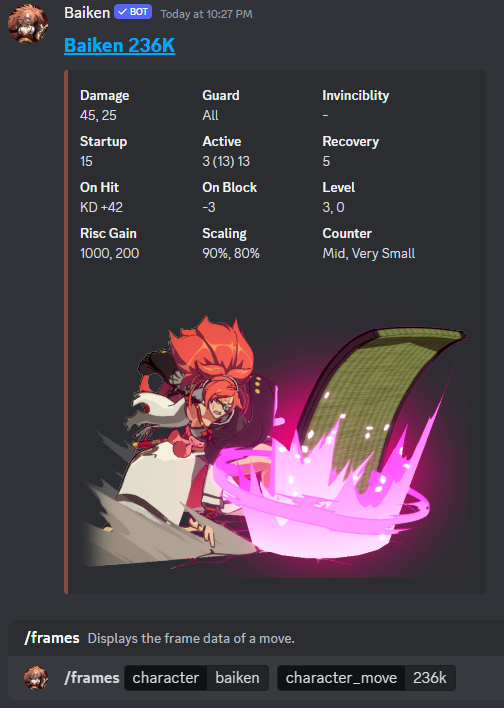
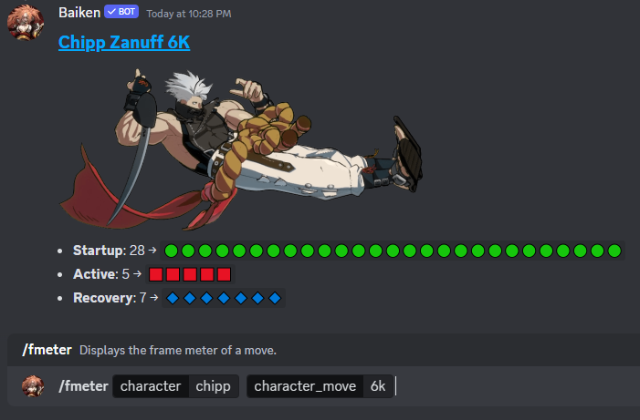
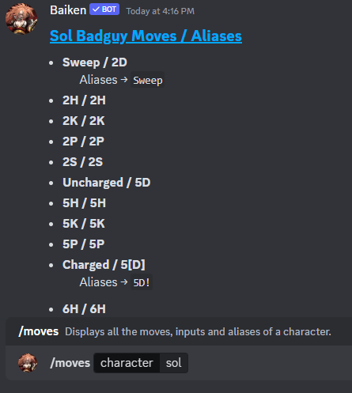
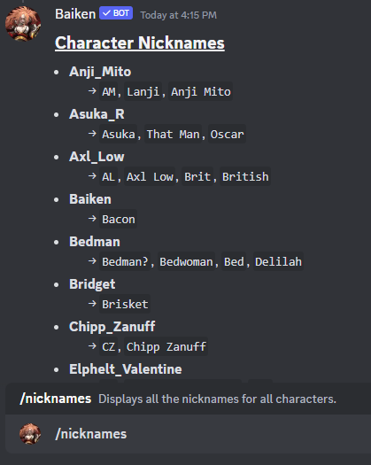
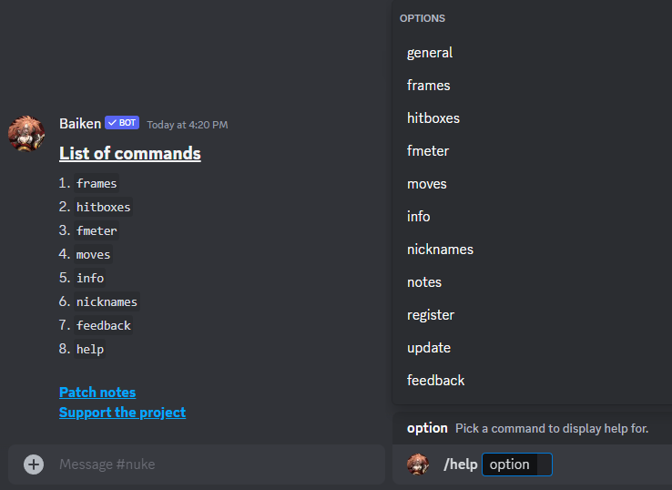

# Baiken

## Your favorite one-handed samurai lady helps you learn Guilty Gear Strive by providing you with character moves, frame data, hitboxes and more.

# Table of contents.
- **[Patch notes](https://github.com/yakiimoninja/baiken/releases)**
- **[Inviting Baiken to a server](#inviting-baiken-to-a-server)**
- **[Support](#support)**
- **[Commands](#commands)**
    - **[Usage notes](#usage-notes)**
    - **[Nicknames](data/nicknames.json)**

# Patch notes.
- You can view the latest patch notes by [**pressing here**](https://github.com/yakiimoninja/baiken/releases).

# Inviting Baiken to a server.
### Currently in 650+ servers and 14 official character Discords.
- Baiken can be **invited** to a server by [**pressing here**](https://discord.com/api/oauth2/authorize?client_id=919027797429727272&permissions=2147535872&scope=bot%20applications.commands).
- Or scanning the **QR Code** with a Camera or Discord application.

    

# Commands.
## **Command**: `/frames`.
**Displays move's frame data.**

    
Show example.

        

            
        

## **Command**: `/fmeter`.
**Displays visually, move's startup, active and recovery frames.**

    
Show example.

        

            
        

## **Command**: `/hitboxes`.
**Displays move's hitbox images.**

    
Show example.

        

            
        

  
## **Command**: `/moves`.
**Displays character's moves, inputs and aliases.**

    
Show example.

        

            
        

## **Command**: `/info`.
**Displays general character information.**

    
Show example.

        

            
        

## **Command**: `/nicknames`.
**Displays all character nicknames.**

    
Show example.

        

            
        

## **Command**: `/help`.
**Displays a relative help message per option selected.** \

    
Show example.

        

            
        

## **Command**: `/feedback`.
**Sends feedback or requests to the dev.**

    
Show example.

        

            
        

## **Command**: `/update`.
**Updates the frame data,image links and or info for all or a specific character according to [**dustloop**](https://dustloop.com).** \
_**This command works only for owners.**_

    
Show example.

        

            
        

## **Command**: `/register`.
**Registers or removes all slash commands in the current or every server the bot is present.** \
_**This command works only for owners.**_

    
Show example.

        

            
        

## **Command**: `/xx`.
**Disables or enables easter eggs in the current server.** \
_**This command works only for admins.**_

# Usage notes.

- **All searching is case insensitive.**
  - All names, nicknames, moves and aliases are case agnostic.
  - Example: `/hitboxes ky dp` = `/hitboxes KY dP`.

- **Character searching.**
    - Characters can be found either using a part of their name, or any of their [nickname's](https://github.com/yakiimoninja/baiken/blob/main/data/nicknames.json) that exist.
    - Example: `/moves Happy Chaos` = `/moves happy` = `/moves hc`.

- **Move searching.**
    - Moves can be found either using a part of their name, their input, or any of their existing aliases.
        - Example: `/frames Anji Needles` = `/frames Anji 236HP` = `/frames Anji ichi`.
    - Charged moves can be found with or without the use of `[]`.
        - Example `/frames may 46S` = `/frames may [4]6S`.
    - All dots in move names are automatically ignored.
        - Example: `/frames leo bts` = `/frames leo bt.S`.
    - For a fully charged dust attack, the alias `5D!` can be used instead.
        - Example: `/frames chipp 5D!`.

- **Character specifics.**
    - **For normals that have levels. (e.g. Nagoriyuki).**
        - Add the level number next to the normal.
        - For Level 1 `fS`: `/frames nago fs`. 
        - For Level 2 `fS`: `/frames nago fs2`.
        - For Level 3 `fS`: `/frames nago fs3`.
        - For Level 1 normals nothing needs to be added since it's the default state.

    - **For specials that have levels. (e.g. Goldlewis).**
        - Add the level number next to the special.
        - For Level 1 `Thunderbird`: `/frames gold Drone`.
        - For Level 2 `Thunderbird`: `/frames gold Drone 2`.
        - For Level 3 `Thunderbird`: `/frames gold Drone 3`.
        - The above is not always the case depending on the special move and alias used.
        - For Level 1 `Thunderbird`: `/frames gold D1`.
        - For Level 2 `Thunderbird`: `/frames gold D2`.
        - For Level 3 `Thunderbird`: `/frames gold D3`.
        - See `/moves gold` for more info on his aliases.

    - **For Testament's different Grave Reaper versions.**
        - Regular version: `/frames testament 236S`.
        - Partially charged version: `/frames testament 236S!`.
        - Fully charged version: `/frames testament 236S!!`.
#
# Support.
Support the project by donating here.

# Special thanks.

- To [Dustloop](https://dustloop.com) for providing the technical character data.
- To [Gogalking](https://x.com/gogalking) for permitting the use of their Baiken artwork.
